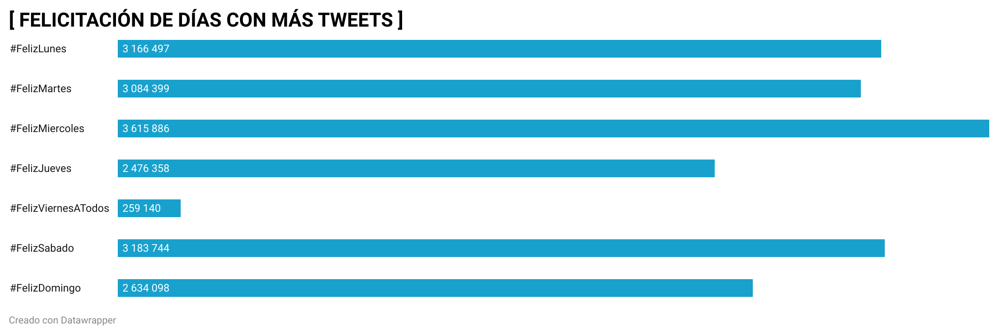

# PRÁCTICA 3 GRÁFICO DATAWRAPPER #

En este ejercicio he realizado un gráfico con datawrapper a partir de los datos extraídos del archivo "feliz". Con tal cantidad de datos, eran muchas las posibles opciones sobre las que trabajar y realizar el pertinente gráfico. Finalmente, me decanté por investigar a partir de los hasthag de felicitación de cada día de la semana con el objetivo de averiguar que día se felicitaba más por twitter (dato que refleja el gráfico realizado).

Para ello, he realizado el siguiente procedimiento:

Lo primero fue editar los datos del archivo "feliz" con el OpenRefine. Así, quité todos los hashtag que no tuviesen datos. Para ello seleccioné columna, número, facet, customized facet, facet by  null). A continuación seleccioné los "true", marqué con la estrellita, edit rows, remove. 
Posteriormente realicé el filtrado de fechas mediante facet y timelime, y lo mismo con el filtrado de texto, mediante timefacet y posteriormente un cluster en la columna 3.

A continuación, a través de los filtros seleccioné "feliz lunes", rows, start rows para seleccionar los lunes. Una vez realizado con el lunes, efectué los mismos pasos con cad día de la semana y su respectivo hashtag. Una vez marcados, hacemos flechia en all, facet, facet by star, true. Quedando así seleccionados tan solo los datos relativos a los días de la semana.

Una vez alcanzado este punto, exporté el archivo como Excel, y además, abrí otro documento de excel para poder trabajar sobre él. Ene ste segundo documento escribí cada hasthag a analizar. Con la función sumar.si obtuve el total de tweets publicados de cada hasthag registrado durante el periodo de tiempo a analizar.

Una vez finalizado el trabajo en excel, guardé el archivo como csv.

A continuación, abrí datawrapper iniciando sesión con la misma cuenta que github.
Una vez en datawrapper seleccioné el gráfico que me pareció más adecuado para ilustrar los datos reflejados.

